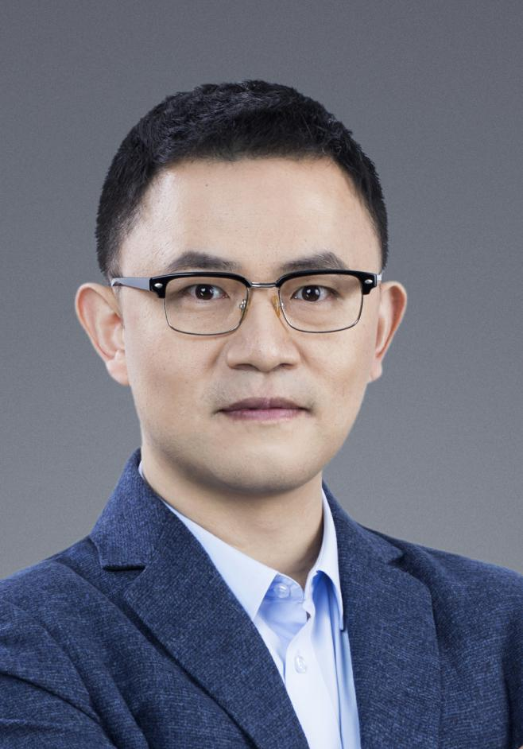
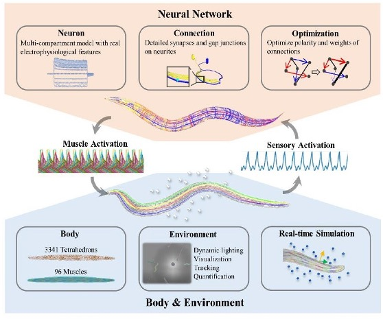
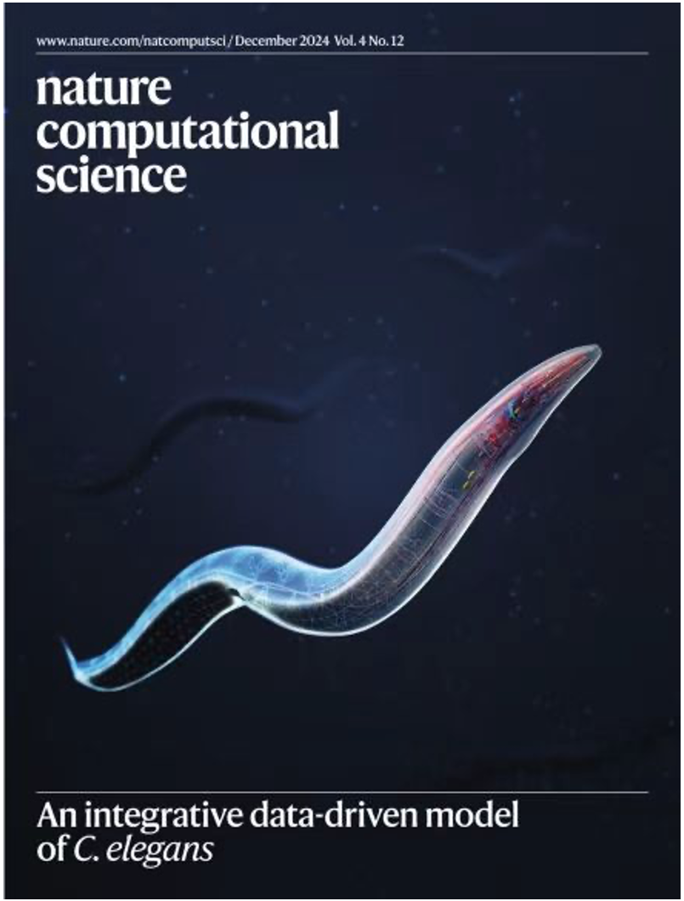
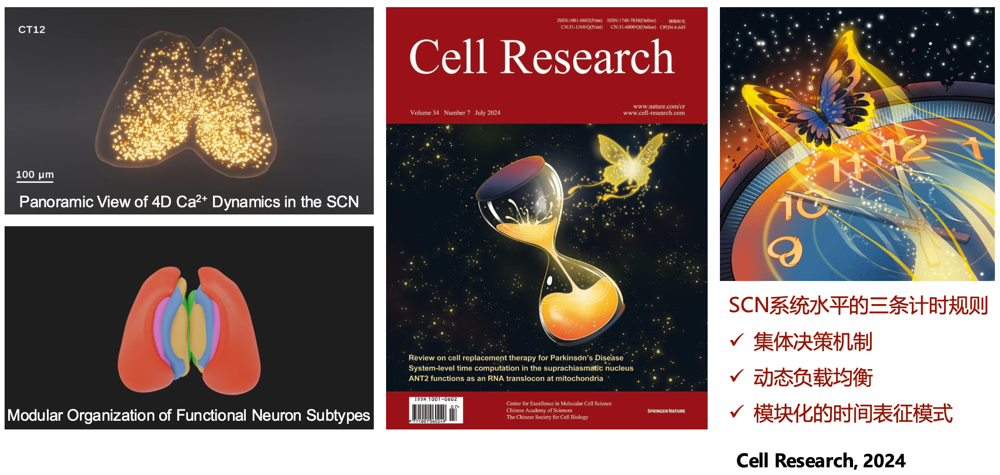

<html lang="zh-CN">
<head>
    <meta charset="UTF-8">
    <meta name="viewport" content="width=device-width, initial-scale=1.0">
    <title>Insight Lab</title>
    
</head>

<body>
    <nav class="navbar">
        <a href="/" class="logo">Insight Lab</a>
        <ul class="nav-links">
            <li><a href="/">Home</a></li>
            <li><a href="members">Members</a></li>
            <li><a href="research">Research</a></li>
            <li><a href="fulllist">Publications</a></li>
        </ul>
    </nav>

    

        

            
            

                <h1>马雷</h1>
                
<strong>北京大学国家生物医学成像科学中心 研究员（PI）、博士生导师</strong>

                
<strong>北京市杰出青年</strong>

                
<strong><a href="https://mp.weixin.qq.com/s/o9HHS7PkMGN8eQ6bg6KK4w?scene=2">2025-2026 博古睿学者</a></strong>

                
<strong>北京智源人工智能研究院 智源学者</strong>

                
<strong>国家重大科技基础设施- "多模态跨尺度生物医学成像设施" 装置四负责人</strong>

                
邮箱：<a href="mailto:lei.ma@pku.edu.cn">lei.ma@pku.edu.cn</a>

                
地址：北京市海淀区颐和园路5号北京大学王克桢楼209

            

        

    

    

        <h1>Short Bio</h1>
        
马雷博士的研究方向为人工智能与数字生命。共计发表学术论文近70篇。近三年以第一或通讯在Nature Computational Science(2024、封面文章)、Cell Research(2024、封面文章）、National Science Review（2025）、MIA（2024）、Nature Communications(2023)、ACM/IEEE汇刊等国际期刊及CVPR、NIPS、ECCV等人工智能会议发表32篇论文，代表工作包括数据驱动秀丽线虫"天宝"、精细神经元动力学快速求解算法、SCN神经元集群时间编码模型、神经形态相机等。承担"科技创新2030"重大项目课题（2022）、北京市科技计划（2023）、北京市杰出青年科学基金（2024）、北京市非共识项目（第一批、2025）等多个重要项目。

        
<strong>课题组尚有26年硕士起点博士名额，有意者联系<a href="mailto:lei.ma@pku.edu.cn">lei.ma@pku.edu.cn</a></strong>

    

    

        <h1>Research</h1>
        
        <h3>1. Nature Computational Science 期刊封面 - 国际首个秀丽线虫闭环仿真模型</h3>
        

            

                
                
            

            
            

                
秀丽线虫是生命科学研究的重要模式动物之一，常被用于研究神经系统的工作机制。当前脑科学研究侧重解析神经系统的局部工作机制，如何整合大脑不同层级的细节，进而构建完整的生物体仿真一直是领域内的重大挑战。

                
马雷团队首次实现了线虫神经网络模型与身体环境模型的闭环交互仿真，完整模拟了秀丽线虫的大脑、身体与环境的动态相互作用（Nature Computational Science 2024，12月封面文章，编辑推荐，期刊同期发表Research Briefing 报道）。

            

        

        <h3>2. Cell Research 期刊封面 - 脑解码：SCN神经元集群时间编码模型</h3>
        

            
            

                
视交叉上核（Suprachiasmatic Nucleus, SCN）是哺乳动物昼夜节律的中枢，现有研究主要聚焦于个体神经元的分子节律机制，系统层面如何编码时间仍然未解。马雷与合作者结合新型高速双视角双光子显微镜成像技术和机器学习技术，提出了SCN群体决策与空间模块化特征表示的新概念，为生物钟的系统设计提供了全新视角（Cell Research (2024)）。

            

        

    

    

        <h1>Selected Publications <a href="fulllist">[Full List]</a></h1>
        
(# Equal Contribution, *Corresponding Author)

        
        

            
<strong>1. An initiative on digital nephrology: the Kidney Imageomics Project.</strong>

            
Fangxu Zhou, Zehua Li, Haifeng Li, Yao Lu, Linjia Cheng, Ying Zhang, Zichen Wang, Jing Nie, Heping Cheng, Bin Dong*, Lei Ma*, Li Yang*

            
<em>National Science Review</em>

        

        
        

            <a href="https://xhnewsapi.xinhuaxmt.com/share/news_pc?id=1059512391118848&showType=3001&utdId=null&version=4.0.7&twoShare=1&uuid=9530-453f-ec50-b6b7-d8d2" target="_blank" class="xinhua-link">Xinhua News - 2025年3月</a>
            <a href="https://h.xinhuaxmt.com/vh512/share/12443882?d=134fec8" target="_blank" class="xinhua-link">新华社 - 2025年3月</a>
        

        
        

            
<strong>2. An integrative data-driven model simulating C. elegans brain, body and environment interactions.</strong>

            
Mengdi Zhao, Ning Wang, Xinrui Jiang, Xiaoyang Ma, Haixin Ma, Gan He, Kai Du, Lei Ma* & Tiejun Huang.

            
<em>Nature Computational Science</em>

        

        
        

            <a href="https://h.xinhuaxmt.com/vh512/share/12341233?d=134db4c" target="_blank" class="xinhua-link">新华社 - 新华视点 - 2024年12月</a>
            <a href="https://tv.cctv.com/2023/01/21/VIDEEG17Lt1mLKlDsrkqbGWG230121.shtml?spm=C55924871139.PT8hUEEDkoTi.0.0" target="_blank" class="xinhua-link">CCTV 9</a>
            <a href="https://h.xinhuaxmt.com/vh512/share/10845612" target="_blank" class="xinhua-link">新华社</a>
            <a href="https://h.xinhuaxmt.com/vh512/share/10845254" target="_blank" class="xinhua-link">新华社</a>
        

        
        

            <a href="https://tv.cctv.com/2025/03/01/VIDEBHUUetmfDfV1fG5N1ZXJ250301.shtml?spm=C53156045404.PKXC0xLPAnP9.0.0" target="_blank" class="xinhua-link">CCTV - 新闻直播间 - 2025年3月 - 大模型"智"在何方，数字线虫"天宝" 开启生物智能新范式</a>
        

        
        

            
<strong>3. System-level time computation and representation in the suprachiasmatic nucleus revealed by large-scale calcium imaging and machine learning.</strong>

            
Zichen Wang, Jing Yu, Muyue Zhai, Zehua Wang, Kaiwen Sheng, Yu Zhu, Tianyu Wang, Mianzhi Liu, Lu Wang, Miao Yan, Jue Zhang, Ying Xu, Xianhua Wang, Lei Ma*, Wei Hu* & Heping Cheng*.

            
<em>Cell Research</em>

        

        
        

            <a href="https://h.xinhuaxmt.com/vh512/share/10845254" target="_blank" class="xinhua-link">新华社</a>
            <a href="http://www.bj.xinhuanet.com/20240418/e84ab548d7dd4bacb928489e4c04d6a2/c.html" target="_blank" class="xinhua-link">新华社</a>
        

        
        

            
<strong>4. A GPU-based computational framework that bridges Neuron simulation and Artificial Intelligence</strong>

            
Yichen Zhang#, Gan He#, Lei Ma#, Xiaofei Liu, JJ Johannes Hjorth, Alexander Kozlov, Yutao He, Shenjian Zhang, Jeanette Hellgren Kotaleski, Yonghong Tian, Sten Grillner, Kai Du, Tiejun Huang.

            
<em>Nature Communications</em>

        

        
        

            
<strong>5. Embedded prompt tuning: Towards enhanced calibration of pretrained models for medical images</strong>

            
Wenqiang Zu#, Shenghao Xie#, Qing Zhao#, Guoqi Li, Lei Ma*

            
<em>Medical Image Analysis</em>

        

    

    

        <h1>Opportunities</h1>
        
        <h3>1. 研究生</h3>
        
我们正在积极寻找优秀的学生加入我们的课题组，研究领域包括但不限于：计算生物学、人工智能、计算机图形学、计算机视觉。

        
课题组尚有26年硕士起点博士名额，有意者联系<a href="mailto:lei.ma@pku.edu.cn">lei.ma@pku.edu.cn</a>

        
        <h3>2. 博士后研究员</h3>
        
我们正在招聘 数字生命/生物医学大模型/软件开发 方向的博士后研究员，有意者可联系<a href="mailto:lei.ma@pku.edu.cn">lei.ma@pku.edu.cn</a>或者<a href="mailto:jie.sun@pku.edu.cn">jie.sun@pku.edu.cn</a>

        
具体招聘信息参考链接：<a href="#">北京大学未来技术学院马雷课题组招聘博士后</a>

    

    

        
<strong>联系方式：</strong>

        
邮箱：<a href="mailto:lei.ma@pku.edu.cn">lei.ma@pku.edu.cn</a>

        
地址：北京市海淀区颐和园路5号北京大学王克桢楼209

    

</body>
</html>
