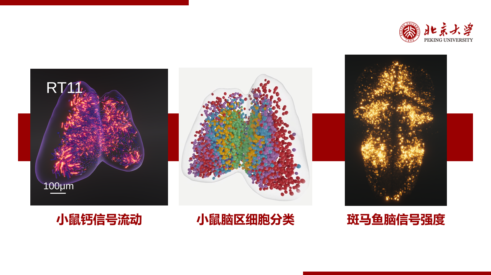
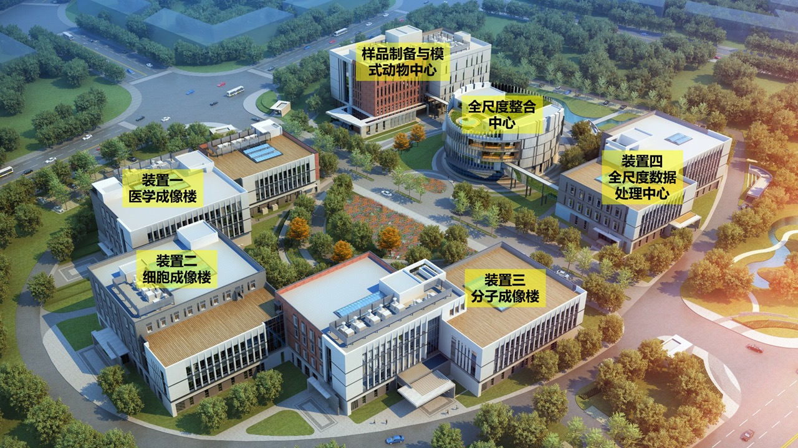

<html lang="en">
<head>
    <meta charset="UTF-8">
    <meta name="viewport" content="width=device-width, initial-scale=1.0">
    <title>Research-Insight Lab</title>
    
</head>
<body>
    <nav class="navbar">
        <a href="/" class="logo">Insight Lab</a>
        <ul class="nav-links">
            <li><a href="https://qkm025.github.io/maleilab.github.io/">Home</a></li>
            <li><a href="members">Members</a></li>
            <li><a href="research">Research</a></li>
            <li><a href="fulllist">Publications</a></li>
        </ul>
    </nav>
    
    

        <h2><a href="https://qkm025.github.io/maleilab.github.io/">Home</a> &raquo; Research</h2>
    

    
    

        

            
The Computational Odyssey in Biological Exploration: Computational methods play a pivotal role in life science research. With advancing technology, we have amassed a wealth of biological data containing intricate information. However, traditional experiments struggle to unveil this complexity. Fortunately, computational methods introduce new possibilities. The application of intelligent algorithms enables the processing and analysis of high-throughput data, helping us uncover patterns and correlations within the data. Additionally, the use of visualization techniques makes life processes more intuitive, providing valuable insights for scientific research. Moreover, modeling and simulation can simulate biological systems at different scales, aiding in disease prediction, drug discovery, and mechanistic understanding. In summary, computation will deepen our comprehension of life and propel the advancement of life science research.

        

        
        

            

                

                    
                

                

                    <h1>Biomedical data realistic rendering</h1>
                    
High-quality visualization can assist researchers in gaining deeper intuition and insights. We are dedicated to developing and offering world-leading cinematic computer graphics techniques to our collaborators for their research endeavors.

                

            

            
            

                

                    
                

                

                    <h1>Biomedical image foundation model</h1>
                    
In recent years, foundation models have revolutionized numerous research fields. This cutting-edge technology offers a promising approach to process, integrate, and comprehend vast amounts of biomedical images, thereby fostering the advancement of biomedical research.

                

            

            
            

                

                    
                

                

                    <h1>Multimodal trans-scale biomedical image integration</h1>
                    
Accurately describing the temporal and spatial dynamics of life activities is crucial in biomedical research. This necessitates the integration of multimodal information and overcoming multi-scale barriers.

                

            

        

    

</body>
</html>
